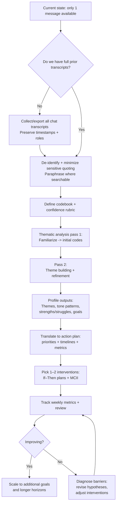

# Comprehensive Analytical User Profile Based on Available Chat Evidence

## Executive summary

This profile is necessarily *data-limited*: in the chat context available to me here, the only primary evidence about the user consists of a single, highly structured request specifying deliverable requirements (tables, timelines with success metrics, and a mermaid diagram), strict evidence constraints (“based solely on all prior chat transcripts… do not use external personal data”), and locale/date context (en-US preference; date 2026-03-03; timezone Europe/Amsterdam, i.e., entity["city","Amsterdam","Netherlands"]). As a result, any “recurring” themes, emotional shifts over time, or persistent struggles cannot be validly established from the evidence provided.

Within those limits, the request itself provides strong, direct evidence of a user who prioritizes rigor, explicit assumptions, methodological transparency, and operational outputs (prioritized actions, timelines, and measurable success criteria). The tone is formal, directive, and outcomes-oriented, with low personal self-disclosure and an emphasis on constraints, scope control, and auditability (“Prioritize primary evidence… Explicitly state assumptions and gaps… Provide tables… metrics… mermaid”). These linguistic and structural choices indicate high comfort with analytical artifacts and a preference for actionable synthesis rather than exploratory conversation.

Given insufficient longitudinal transcript evidence, the most defensible recommendations are process-oriented: (a) obtain/curate the missing transcript corpus; (b) analyze it using a transparent qualitative workflow (e.g., thematic analysis phases, with optional computational text features as secondary signals); (c) translate findings into a behavior-change plan with lightweight, evidence-based self-regulation techniques (goal specificity, if–then planning, and mental contrasting + implementation intentions), tracked by simple metrics and reviewed iteratively. Thematic analysis workflows commonly proceed via staged familiarization, coding, and theme refinement, and emphasize systematic, comprehensive coding rather than cherry-picking vivid examples. citeturn12view0turn12view2

## Evidence base and data limitations

**Primary evidence actually available in this chat context**
- One user message containing: deliverable specifications; constraints (“based solely on all prior chat transcripts”; “do not use external personal data”); requested sections; formatting requirements (tables, mermaid); and locale/date context (en-US; 2026-03-03; Europe/Amsterdam).

**Evidence not available (critical gaps)**
- No prior chat transcripts were provided or visible in the current context; therefore:
  - “Recurring themes/topics,” “progression of issues,” and “recurring struggles” are **unverifiable**.
  - Any claim about emotional change over time, coping patterns, habits, trauma history, mental health, relationships, work context, or motivations beyond the single request would be speculative.

**Assumptions used (explicit)**
1. The single request is representative of *at least one* stable preference: a desire for structured, analytical output. This is a *low-risk* inference because it is directly observable in the request’s format and constraints.
2. Any deeper traits (e.g., perfectionism, anxiety, chronic indecision) are **not assumed**; where hypotheses are offered, they are labeled *low-confidence* and framed as possibilities to test against future transcript evidence.

**Ethical and privacy posture**
Even when profiling is requested by a user, best practice for transcript-based analysis is to (a) minimize identifiability, (b) avoid unnecessary sensitive inferences, and (c) be transparent about what is and is not supported by the data. Guidance on internet-mediated research also highlights privacy risks from verbatim quotes that can be reverse-searched and recommends attention to anonymization (including paraphrasing in some contexts). citeturn10view1turn11view0turn11view1  
Widely used internet research ethics guidance also emphasizes contextual, case-by-case ethical reflection and informed-consent challenges across research stages. citeturn9view1turn11view2

## Synthesis of themes, emotional tone, and conversational patterns

Because only one message is available, the following are **themes present in the available transcript**, not “recurring themes.”

### Themes observed in the user’s request (with evidence and confidence)

| Theme / signal in the transcript | Primary evidence snippet (verbatim) | What it most likely indicates | Confidence given current evidence |
|---|---|---|---|
| Strong preference for rigor and comprehensiveness | “deep research… comprehensive, analytical profile… analytical and rigorous” | High value placed on thoroughness and structured reasoning | High |
| Preference for explicit epistemic boundaries | “Explicitly state assumptions and any gaps due to missing data.” | Desire to separate facts from inference; discomfort with hand-wavy conclusions | High |
| Operational orientation (plans, actions, metrics) | “prioritized recommendations… timelines and success metrics… next steps (short-, medium-, long-term)” | Likely bias toward execution, measurement, and accountability | High |
| Comfort with structured artifacts and technical formatting | “Provide tables… Include a timeline or flowchart (use mermaid)” | Familiarity with technical/analytical communication tools | Medium–High |
| Privacy / scope control | “based solely on… prior chat transcripts… do not use external personal data” | Concern for data provenance; preference for auditability; possibly privacy sensitivity | High |
| Low self-disclosure / depersonalized framing | Instruction-heavy content; little autobiographical context | Either (a) early-stage engagement, or (b) preference to keep conversation impersonal and task-focused | Medium |

### Emotional tone (within-message)

The message reads as **formal, directive, and task-focused**. There are no explicit affect markers (e.g., “I’m stressed,” “I’m excited”), no hedging, and minimal interpersonal language; instead there is high constraint density (“Include… Explicitly… Provide… Prioritize…”). With only one sample, no stable emotional baseline can be established.

### Conversational patterns (within-message)

The interaction style implied by the request resembles an **RFP/specification**: it enumerates required sections, formatting, and inclusion criteria, and sets evidence constraints. This suggests the user may prefer responses that:
- follow a clear structure,
- respect constraints precisely,
- quantify progress where possible,
- and distinguish observed evidence from inference.

## Identified strengths, skills, and competencies

With limited data, strengths can only be inferred from the *skills implied by the request’s construction*, not from demonstrated life outcomes.

### Strengths with supporting evidence and implications

| Strength / competency implied by the message | Evidence in transcript | Practical implication for how support should be designed | Confidence |
|---|---|---|---|
| Specification literacy (ability to define deliverables and constraints) | The message defines required sections, tables, timelines, and boundaries | The user will likely respond well to structured outputs, explicit acceptance criteria, and traceability | High |
| Analytical thinking and appetite for synthesis | “analytical and rigorous”; emphasis on “synthesis” and “root causes” | The user may prefer frameworks, models, and causal hypotheses—*if clearly labeled* | Medium–High |
| Systems/measurement orientation | “success metrics,” “timelines,” “prioritized recommendations” | Interventions should include KPIs, leading indicators, and review cadences | High |
| Method/tool comfort (technical communication) | “use mermaid”; request for tables | Visual logic models, flowcharts, and structured templates may be especially effective | Medium–High |
| Evidence discipline | “Prioritize primary evidence… do not use external personal data.” | The user is likely to value “source of truth” discipline and may distrust ungrounded personalization | High |

**Methodological note:** If/when full transcripts are available, these hypothesized competencies should be validated by systematically coding for instances where the user (a) asks for metrics, (b) requests structured plans, (c) challenges assumptions, or (d) corrects constraint violations. A staged thematic analysis approach explicitly recommends careful familiarization followed by systematic coding and theme refinement. citeturn12view0turn12view2

## Recurring struggles, challenges, and potential root causes

### What can be stated from evidence

From the available message alone, **no recurring struggles are evidenced**. The user does not describe problems, symptoms, conflicts, dissatisfaction, or obstacles in their life or work. Therefore, any “struggles” section must primarily document *unknowns* and provide *hypotheses to test* once transcripts exist.

### Low-confidence hypotheses consistent with the request (to be validated later)

These are framed as *possible* drivers for requesting a rigorous self-profile; they should be treated as prompts for transcript verification, not conclusions:

1. **Need for clarity in ambiguous self-information environments.** The user requests explicit assumptions, gaps, and evidence provenance, which can reflect discomfort with vague general advice or prior experiences of low-precision guidance.
2. **A desire to move from insight to execution.** The requirement for prioritized actions and success metrics suggests the user may be trying to operationalize self-understanding into behavior change.
3. **Preference for control and auditability.** The constraint to use only transcript evidence and note missing data could imply a strong preference for defensible claims and avoidance of overreach.

None of these can be confirmed without additional transcript evidence.

### Root-cause analysis: currently infeasible

Root-cause analysis requires repeated instances of obstacles, contexts, triggers, and outcomes. With only one message, causal attribution would be speculative and potentially misleading. If/when transcripts are available, a defensible approach is to:
- map challenges to contexts (work, relationships, health, identity),
- identify antecedents and consequences (ABC structure),
- and test competing hypotheses rather than locking into a single narrative.

## Communication style, preferences, and inferred goals or motivations

### Communication style and preferences (supported)

The message provides strong evidence for the following preferences:

- **Structure-first communication:** the user specifies exact sections and artifacts (tables, mermaid).
- **Transparency:** explicit requirement to state assumptions and gaps.
- **Evidence provenance and privacy boundaries:** only transcript-derived evidence; no external personal data; unspecified data should be labeled.
- **Actionability:** concrete recommendations across time horizons with metrics.

These align with a user who likely wants a response that looks like a professional analytical deliverable, not an informal conversation.

### Likely goals/motivations (inferred, but constrained)

With only one message, goals can be inferred only at a general level:

- **Self-understanding through evidence:** the user wants a profile “based solely on… transcripts,” implying a desire for grounded self-insight rather than generic personality typing.
- **Improvement through planning:** the emphasis on prioritized recommendations, timelines, and success metrics implies a motivation to *change something* (habits, decision-making, productivity, wellbeing, etc.), though *what* is unknown.
- **Meta-cognitive interest:** requesting analysis of “conversational patterns” and “emotional tone” suggests interest in how they communicate and how that reflects underlying needs or patterns.

These inferences should be revisited after transcript review.

## Opportunities for growth and prioritized recommendations with metrics

Because user-specific struggles are unknown, recommendations focus on (a) enabling a valid transcript-based profile and (b) offering evidence-based self-regulation tools that fit the user’s apparent preference for structured, measurable plans.

### Recommended actions with timelines and success metrics

| Priority | Time horizon | Action | Why this is recommended (fit + evidence) | Success metrics (leading + lagging) |
|---|---|---|---|---|
| Highest | Short-term (days–2 weeks) | **Assemble the transcript corpus** (export and consolidate all prior chats into one dataset; preserve timestamps; keep system/assistant/user roles) | Without transcripts, “recurring themes” and timelines are not possible; establishing a complete corpus is prerequisite for rigor | Leading: % of conversations exported; completeness check (missing days/threads). Lagging: stable “analysis-ready” corpus created |
| Highest | Short-term (days–2 weeks) | **Define an explicit coding protocol** (what counts as a “theme,” how to code tone, how to handle ambiguous evidence, and confidence scoring) | Thematic analysis emphasizes systematic coding and staged refinement rather than ad hoc impressions. citeturn12view0turn12view2 | Leading: codebook drafted; inter-pass consistency (same coder re-codes a sample and checks agreement). Lagging: themes reproducible across passes |
| High | Short-term (1–3 weeks) | **Privacy-safe quoting strategy** (minimize verbatim quotes; paraphrase when reverse-search risk exists; remove identifiers) | Internet-mediated research guidance notes identifiability risks from quoted text and recommends attention to anonymization/paraphrasing. citeturn10view1turn11view0turn11view1 | Leading: removal of names/IDs; paraphrase ratio for sensitive excerpts. Lagging: low re-identification risk review passed |
| High | Medium-term (3–6 weeks) | **Create a “themes → interventions” mapping** (each major theme gets 1–3 candidate interventions; define mechanism, effort level, and metric) | Converts insight into an operational plan consistent with the user’s preference for measurable actions | Leading: mapping coverage (% themes mapped). Lagging: adoption rate; theme-specific KPIs improved |
| Medium | Medium-term (4–8 weeks) | **Adopt if–then plans for 1–2 priority behaviors** (implementation intentions) | Implementation intentions specify a situational cue and a goal-directed response in an if–then format, which supports execution by linking cues to actions. citeturn5view4turn6view2 | Leading: # of if–then plans written; weekly adherence check. Lagging: target behavior frequency increases, measured weekly |
| Medium | Medium-term (4–8 weeks) | **Use “mental contrasting + implementation intentions” (MCII/WOOP-style) for goal pursuit** | A large meta-analysis reports MCII as a brief, effective strategy for goal attainment with small-to-moderate effects, while noting possible publication bias and moderator effects. citeturn7view1 | Leading: # MCII sessions/week; obstacle identification quality (self-rated). Lagging: goal progress score; objective milestone completion |
| Medium | Long-term (2–6 months) | **Set a small number of specific, difficult goals with feedback loops** | Goal-setting research summarizes that specific, difficult goals tend to outperform “do your best” exhortations, and discusses mechanisms (direction, effort, persistence). citeturn5view1turn6view1 | Leading: goals written + reviewed weekly; feedback frequency. Lagging: measurable performance/behavior outcomes by quarter |
| Optional | Long-term (as needed) | **Motivation clarification sessions** (e.g., structured self-interview; “change talk” journaling) | Motivational interviewing is an evidence-based, collaborative approach designed to help motivate behavior change when ambivalence exists; it can be adapted as a self-reflection style. citeturn7view3turn2search2 | Leading: # reflection sessions; clarity ratings. Lagging: reduced ambivalence, sustained action over 8–12 weeks |

### How these interventions align with the user’s apparent preferences

- They are **structured** (protocols, templates, if–then),
- **measurable** (explicit leading/lagging metrics),
- and **transparent about evidence strength** (meta-analytic effect sizes, moderators, and limitations). citeturn7view1turn5view4

### Mermaid flowchart of the recommended progression

## Potential resources, tools, and supports tailored to this user’s constraints

Because personal context is unknown, the safest “tailoring” is to match the *interaction preferences evidenced by the request*: structured, auditable, metric-driven.

**Transcript analysis toolkit (privacy-conscious)**
- A **codebook-driven thematic analysis workflow** with staged passes (familiarization, coding, theme refinement) and explicit stopping rules helps keep the analysis rigorous and repeatable. citeturn12view0turn12view2  
- Optional **linguistic feature extraction** (e.g., category-based text analysis such as LIWC-style approaches) can complement qualitative themes, with the important caveat that word-use patterns are context-dependent and should not be over-interpreted as personality “ground truth.” citeturn5view3turn6view3turn4search1  
- A **privacy review** step is recommended because verbatim text can sometimes be reverse-located; anonymization and paraphrasing can reduce that risk. citeturn10view1turn11view0turn11view1  

**Behavior and goal execution toolkit (evidence-based, low overhead)**
- **Implementation intentions (if–then planning):** specify “when/where cue → action,” which helps automate initiation and reduce reliance on in-the-moment deliberation. citeturn5view4turn6view2  
- **MCII (mental contrasting + implementation intentions):** meta-analytic evidence supports small-to-moderate improvements in goal attainment; note that effects vary by delivery style and some bias may exist. citeturn7view1  
- **Goal-setting with specificity and challenge:** research syntheses report that specific, difficult goals generally outperform vague “do your best” goals, via mechanisms like attention direction and persistence. citeturn5view1turn6view1  
- **SMART objectives as a writing heuristic:** originally discussed as a way to write management objectives (historical source), best treated as a formatting aid rather than a complete behavior-change theory. citeturn6view4turn5view2  

**When additional supports might be appropriate**
If future transcripts show distress, persistent avoidance, or functional impairment, structured self-help or clinician-supported interventions may be relevant. For example, internet-based CBT self-help interventions have been systematically reviewed in some populations and contexts, showing measurable symptom improvements in certain studies. citeturn2search13turn2search9  
This is not a diagnosis recommendation; it is a contingent resource category that depends entirely on what the missing transcript evidence reveals.

**Summary of what is unspecified**
- Demographics, occupation, health status, relationship context, and any concrete struggles: **unspecified**.
- Emotional baseline and changes over time: **unspecified**.
- Specific goals (career, health, learning, relationships): **unspecified**.
- Therefore, any “personalized” intervention beyond the user’s expressed preference for rigor/structure would be premature.

